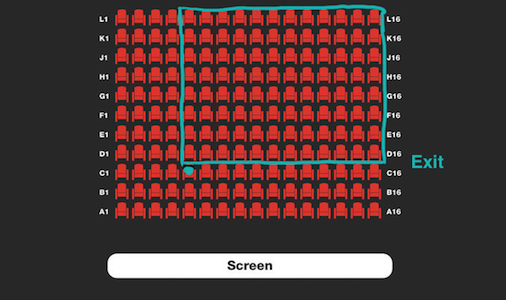

```{.kotlin .cb-run}

fun square(n:Int) = n * n


fun doubleInteger(n:Int) = 2 * n

fun opposite(n: Int) = -1 * n

fun nthEven(n: Int) = 2 * (n - 1)

fun otherAngle(a:Int, b:Int) = 180 - a - b 


fun seatsInTheater(totCols: Int, totRows: Int, col: Int, row: Int) = (totCols -
col + 1) * (totRows - row)


fun past(h:Int, m:Int, s:Int) = 1000 * (s + 60 * m + 60 * 60 * h)

fun multiply(a:Int, b:Int) = a * b

```

# Funktionen

## Funktionen mit einem Parameter

### Aufgabe 
Implementiere eine Funktion `square`{.kotlin}, die eine ganze Zahl
übergeben bekommt und deren Quadrat zurückgibt.

```{.kotlin .cb-nb first_number=1}
square(4)
```
```{.kotlin .cb-nb first_number=1}
square(7)

```

<https://www.codewars.com/kata/523b623152af8a30c6000027/train/kotlin>

### Aufgabe
Implementiere eine Funktion `doubleInteger`{.kotlin}, die das Doppelte
ihres Arguments zurückgibt.

```{.kotlin .cb-nb first_number=1}
doubleInteger(3)
```
```{.kotlin .cb-nb first_number=1}
doubleInteger(10)
```

<https://www.codewars.com/kata/53ee5429ba190077850011d4/train/kotlin>

### Aufgabe
Implementiere eine Funktion `opposite`{.kotlin}, die die Gegenzahl ihres
Arguments zurückgibt. Die Gegenzahl einer Zahl ist genauso weit von der
Null entfernt, wie die Zahl selbst. Die Gegenzahl einer positiven Zahl
ist negativ und die Gegenzahl einer negativen Zahl ist positiv.

<https://www.codewars.com/kata/56dec885c54a926dcd001095/train/kotlin>

```{.kotlin .cb-nb first_number=1}
opposite(2)
```
```{.kotlin .cb-nb first_number=1}
opposite(5)
```

### Aufgabe
Implementiere eine Funktion `nthEven`{.kotlin}, die eine Zahl $n$
übergeben bekommt und die $n$-te gerade Zahl zurückgibt. Die Zahl $n$
ist mindestens eins.

```{.kotlin .cb-nb first_number=1}
nthEven(2)
```
```{.kotlin .cb-nb first_number=1}
nthEven(1)
```
```{.kotlin .cb-nb first_number=1}
nthEven(5)
```

<https://www.codewars.com/kata/5933a1f8552bc2750a0000ed/train/kotlin>

## Mehrere Parameter

### Aufgabe
Implementiere eine Funktion `multiply`{.kotlin}, die zwei ganze Zahlen
übergeben bekommt und deren Produkt zurückgibt.

```{.kotlin .cb-nb first_number=1}
multiply(2, 3)
```
```{.kotlin .cb-nb first_number=1}
multiply(9, 8)
```

<https://www.codewars.com/kata/50654ddff44f800200000004/train/kotlin>

### Aufgabe
Implementiere eine Funktion `otherAngle`{.kotlin}, die aus den Größen
von zwei Winkeln eines Dreiecks in Grad die Größe des dritten Winkels
berechnet.

```{.kotlin .cb-nb first_number=1}
otherAngle(60,30)
```

<https://www.codewars.com/kata/5a023c426975981341000014/train/kotlin>\

### Aufgabe
Kopiere und korrigiere den folgenden Code:

```{.kotlin .cb-nb first_number=1}
fun add_five(num: Int):Int{
    val total = num + 5
    return num
}
```

<https://www.codewars.com/kata/56200d610758762fb0000002/train/kotlin>

### Aufgabe
Implementiere eine Funktion `past`{.kotlin}, die die Stunden Minuten und
Sekunden seit Mitternacht als Argumente übergeben bekommt und die Zeit
seit Mitternacht in Millisekunden zurückgibt. Seit Mitternacht sind
höchstens 23 Stunden und 59 Minuten bzw. Sekunden vergangen.\

Lege um den Code einfacher lesbar zu machen, die lokalen Variablen
`passedHoursInSeconds`{.kotlin}, `passedMinutesInSeconds`{.kotlin} und
`passedTimeInSeconds`{.kotlin} an. Implementiere außerdem eine
Hilfsfunktion `seconsToMilliseconds`{.kotlin} für die Umrechnung von
Sekunden in Millisekunden.

```{.kotlin .cb-nb first_number=1}
past(0,1,1)
```
```{.kotlin .cb-nb first_number=1}
past(1,1,1)
```
```{.kotlin .cb-nb first_number=1}
past(1,1,1)
```

<https://www.codewars.com/kata/55f9bca8ecaa9eac7100004a/train/kotlin>

### Aufgabe 
Implementiere eine Funktion eine Funktion `seatsInTheater`{.kotlin}.
Diese hilft dir zu berechnen wie vielen Leuten du die Sicht versperren
wirst, wenn du während einer Kinovorstellung auf die Toilette musst. Der
Funktion werden die Anzahl der Spalten und Zeilen im Kino übergeben,
sowie die Spalte und die Zeile in der du sitzt.

Im folgenden Bild ist für ein Kino mit mit $16$ Spalten und $11$ Zeilen
und einen Kinobesucher in Spalte $5$ und Zeile $3$ zu sehen, wie vielen
Zuschauern er die Sicht verdeckt.

Nutze für deine Lösung mindestens zwei lokale Variablen.

::: center
{width="50%"}
:::
```{.kotlin .cb-nb first_number=1}
seatsInTheater(16, 11, 5 ,3)
```

<https://www.codewars.com/kata/588417e576933b0ec9000045/solutions/kotlin>

### Aufgabe 
Schreibe Tests für die Aufgaben in diesem Kapitel.
