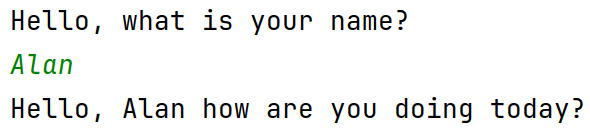
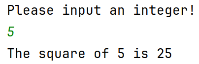
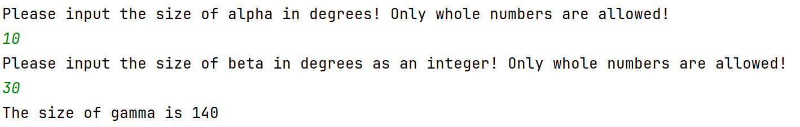

# Ein- und Ausgabe

## Aufgabe
Schreibe eine Funktion `greetIO`{.kotlin}. Die Funktion fragt einen
Benutzer nach seinem Namen und begrüßt diesen dann freundlich an der
Konsole.

**Beispiel**:

{width="60%"}\

## Aufgabe
Schreibe eine Funktion `squareIO`{.kotlin}. Diese bittet den Benutzer
eine Zahl einzugeben und gibt anschließend das Quadrat dieser Zahl an
der Konsole aus.

**Beispiel**:

{width="60%"}\

## Aufgabe
Schreibe eine Funktion `otherAngle`{.kotlin}. Diese bittet den Benutzer
die Größen von zwei Winkel in einem Dreieck einzugeben und gibt
anschließend die Größe des dritten Winkels an der Konsole aus.

**Beispiel**:

{width="100%"}\

## Aufgabe
Untersuche deine Lösungen auf Codewiederholung und schreibe
gegebenenfalls Hilfsfunktionen um diese zu vermeiden. Versuche außerdem
so viel Code wie möglich in testbare Funktionen auszulagern.
