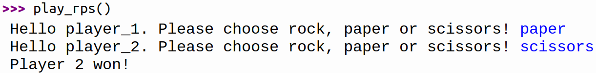

``` {.kotlin .cb-run first_number=1}
fun evenOrOdd(number: Int):String = if (number % 2 == 0)  "Even" else "Odd"

fun simpleMultiplication(number: Int) : Int = if (number % 2 == 0)  8 * number else 9 * number

fun multiple(x: Int) = when {
    x % 15 == 0 -> "BangBoom"
    x % 5 == 0->"Boom"
    x % 3 == 0->"Bang"
    else -> "Miss"
}

fun boolToWord(boolean: Boolean): String = if (boolean) "Yes" else "No"


fun bonusTime(salary: Int, bonus: Boolean): String = "$" + (if (bonus) +10 * salary
else +salary).toString()

fun hoopCount(n: Int): String = if (n < 10) "Keep at it until you get it"
else "Great, now move on to tricks"

fun rps(p1: String, p2: String): String = when {
    p1 == p2 -> "Draw!"
    (p1 == "rock") && (p2 == "scissors") || p1 == "paper" && p2 == "rock" || p1 ==
            "scissors" && p2 == "paper" -> "Player 1 won!"

    else -> "Player 2 won!"
}


fun paperwork(n: Int, m: Int): Int = if (n < 0 || m < 0) 0 else n * m


fun getGrade(s1: Int, s2: Int, s3: Int): String {
    val avgGrade = (s1 + s2 + s3) / 3
    return (when {
        avgGrade >= 90 -> "A"
        avgGrade >= 80 -> "B"
        avgGrade >= 70 -> "C"
        avgGrade >= 80 -> "D"
        else -> "E"
    })

}

fun century(number: Int): Int =  (number / 100) + if (number % 100 == 0) 0 else 1


```

# Bedingte Ausführung

## Zwei Alternativen

### Aufgabe
Implementiere eine Funktion `boolToWord`{.kotlin}, die ein *Boolean*
übergeben bekommt. Wenn dieses `true`{.kotlin} ist, soll
`"Yes"`{.kotlin} zurückgegeben werden. Wenn es `false`{.kotlin} ist,
wird `"No"`{.kotlin} zurückgegeben.

``` {.kotlin .cb-nb first_number=1}
boolToWord(true)
```
``` {.kotlin .cb-nb first_number=1}
boolToWord(false)
```

<!-- <https://www.codewars.com/kata/53369039d7ab3ac506000467/train/kotlin> -->


### Aufgabe
Implementiere eine Funktion `hoopCount`{.kotlin}, die dich motiviert
Hulla-Hoop zu trainieren. Ihr wird die Anzahl der geschafften Drehungen
übergeben. Wenn mehr als $10$ Umdrehungen geschafft wurden, gibt die
Funktion `"Great, now move on to tricks"`{.kotlin} zurück. Bei weniger als
$10$ Umdrehungen soll `"Keep at it until you get it"`{.kotlin} zurück gegeben
werden.

``` {.kotlin .cb-nb first_number=1}
hoopCount(100)
```
``` {.kotlin .cb-nb first_number=1}
hoopCount(1)
```

<!-- <https://www.codewars.com/kata/55cb632c1a5d7b3ad0000145/train/kotlin> -->


### Aufgabe
Deine Kollegen bitten dich darum ihnen Unterlagen zu kopieren.
Implementiere eine Funktion `paperwork`{.kotlin}, die dir hilft die
Anzahl der benötigten Seiten Papier zu berechnen. Der Funktion werden
die Anzahl der Kollegen und die Anzahl der Seiten pro Kollege übergeben.
Wenn negative Zahlen übergeben werden, wurden fehlerhafte Daten
übertragen. In diesem Fall soll `0`{.kotlin} zurückgegeben werden.

``` {.kotlin .cb-nb first_number=1}
paperwork(3, 5)
```
``` {.kotlin .cb-nb first_number=1}
paperwork(-4, 6)
```
``` {.kotlin .cb-nb first_number=1}
paperwork(2, 60)
```

<!-- <https://www.codewars.com/kata/55f9b48403f6b87a7c0000bd/train/kotlin> -->


### Aufgabe
Implementiere eine Funktion `bonusTime`{.kotlin}, die das Gesamtgehalt
eines Mitarbeiters als String zurückgibt. Die Funktion bekommt das
Grundgehalt als *Integer* und ein *Boolean*, das angibt, ob der
Mitarbeiter einen Bonus bekommt. Wenn dies der Fall ist bekommt der
Mitarbeiter das zehnfache seines Grundgehalt. Ansonsten bekommt er nur
das Grundgehalt.

``` {.kotlin .cb-nb first_number=1}
bonusTime(100, false)
```
``` {.kotlin .cb-nb first_number=1}
bonusTime(50, true)
```

<!-- <https://www.codewars.com/kata/56f6ad906b88de513f000d96/train/kotlin> -->


## Mehrere Alternativen

### Aufgabe
Implementiere eine Funktion `rps`{.kotlin}, die genutzt werden kann um
Schere-Stein-Papier zu spielen. Ihr werden die Entscheidungen der beiden
Spieler übergeben und sie gibt zurück, wer gewonnen hat.

{width="40%"}

``` {.kotlin .cb-nb first_number=1}
rps("rock", "scissors")
```
``` {.kotlin .cb-nb first_number=1}
rps("scissors", "paper")
```
``` {.kotlin .cb-nb first_number=1}
rps("rock", "rock")
```

<!-- <https://www.codewars.com/kata/5672a98bdbdd995fad00000f/train/kotlin> -->


### Aufgabe
Implementiere eine Funktion `playRps`{.kotlin}. Mit dieser Funktion kann
man zu zweit and der Konsole Schere-Stein-Papier spielen. Die Funktion
fordert nacheinander die Spieler auf, sich für eine der drei
Möglichkeiten zu entscheiden. Anschließend wird der Gewinner bekannt
gegeben. Gehe davon aus, dass beide Spieler eine korrekte Eingabe
eintippen.

{width="50%"}


### Aufgabe
Implementiere eine Funktion `getGrade`{.kotlin}, die einer Lehrerin an
einer High-School hilft, die Noten in einem Schuljahr zu berechnen. Der
Funktion werden die erzielten Punkte bei drei Klassenarbeiten übergeben.
Sie gibt die erzielte Gesamtnote als String zurück. In jeder Arbeit
konnten maximal $100$ Punkte erreicht werden.

  Umrechnungstabelle                             
  ---------------------------------------------- ------
  Durchschnittliche Punktzahl                    Note
  $90 \leq \textnormal{Durchschnitt} \leq 100$   A
  $80 \leq \textnormal{Durchschnitt} \leq 90$    B
  $70 \leq \textnormal{Durchschnitt} \leq 80$    C
  $60 \leq \textnormal{Durchschnitt} \leq 70$    D
  $0 \leq  \textnormal{Durchschnitt} \le 60$     F

``` {.kotlin .cb-nb first_number=1}
getGrade(90, 91, 95)
```
``` {.kotlin .cb-nb first_number=1}
getGrade(40, 60, 100)
```
``` {.kotlin .cb-nb first_number=1}
getGrade(10, 50, 70)
```

<!-- <https://www.codewars.com/kata/55cbd4ba903825f7970000f5/train/kotlin> -->


### Aufgabe
Passe die Funktion `getGrade`{.kotlin} so an, dass der Durchschnitt nur
einmal berechnet wird.


### Aufgabe
Implementiere eine Funktion `evenOrOdd`{.kotlin}, die eine ganze Zahl
übergeben bekommt und `even`{.kotlin} zurückgibt, wenn diese Zahl gerade
ist. Wenn die Zahl ungerade ist, soll `odd`{.kotlin} zurückgegeben
werden.

``` {.kotlin .cb-nb first_number=1}
evenOrOdd(5)
```
``` {.kotlin .cb-nb first_number=1}
evenOrOdd(4)
```

<https://www.codewars.com/kata/53da3dbb4a5168369a0000fe/train/kotlin>


### Aufgabe

Schreibe eine Funktion `century`{.kotlin}, die berechnet in welchen Jahrhundert ein Jahr ist.

``` {.kotlin .cb-nb first_number=1}
century(350)
```
``` {.kotlin .cb-nb first_number=1}
century(400)

```
``` {.kotlin .cb-nb first_number=1}
century(401)
```
``` {.kotlin .cb-nb first_number=1}
century(402)
```


<https://www.codewars.com/kata/5a3fe3dde1ce0e8ed6000097/kotlin>


### Aufgabe
Implementiere eine Funktion `simpleMultiplication`{.kotlin} die ein
Integer übergeben bekommt. Wenn dieses Integer gerade ist, gibt sie das
achtfache zurück. Wenn es nicht gerade ist, gibt sie das neunfache
zurück.

``` {.kotlin .cb-nb first_number=1}
simpleMultiplication(2)
```
``` {.kotlin .cb-nb first_number=1}
simpleMultiplication(3)
```

<https://www.codewars.com/kata/583710ccaa6717322c000105/train/kotlin>


### Aufgabe
Implementiere eine Funktion `multiple`{.kotlin}, die ein Integer
übergeben bekommt. Wenn dieses Integer durch fünf und drei teilbar ist,
gibt sie `"BangBoom"`{.kotlin} zurück. Wenn das Integer durch fünf aber
nicht durch drei teilbar ist, gibt sie `"Boom"`{.kotlin} zurück. Wenn es
durch drei aber nicht durch fünf teilbar ist, gibt sie `"Bang"`{.kotlin}
zurück. Falls keine der Bedingungen erfüllt ist, so gibt sie
`"Miss"`{.kotlin} zurück.

``` {.kotlin .cb-nb first_number=1}
multiple(2)
```
``` {.kotlin .cb-nb first_number=1}
multiple(30)
```
``` {.kotlin .cb-nb first_number=1}
multiple(20)
```
``` {.kotlin .cb-nb first_number=1}
multiple(12)
```

<https://www.codewars.com/kata/55a8a36703fe4c45ed00005b/train/kotlin>

