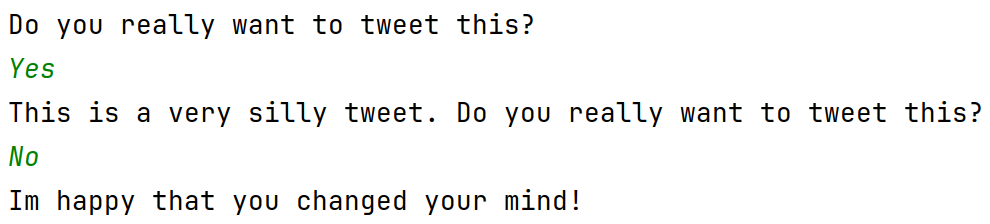

# Bedingte Ausführung
## Aufgabe

Implementiere eine Funktiton `twitter`. Dise fragt einen Benutzer, ob er einen dummen Tweet absenden will. 

- Wenn er Nein sagt, sagt sie, dass das eine gute Entscheidung war.

&nbsp;
&nbsp;
&nbsp;
&nbsp;
{ width=70%}

 - Wenn er Ja sagt, wird er nochmal gefragt. Wenn er jetzt Nein sagt, antwortet das Programm, das es froh ist, dass er sich umentschieden hat.

&nbsp;
&nbsp;
&nbsp;
&nbsp;
{ width=70%}

- Wenn er wieder Nein sagt, wird er nochmal darauf hingewiesen, dass das keine schlaue Entscheidung war.

&nbsp;
&nbsp;
&nbsp;
&nbsp;
{ width=70%}

