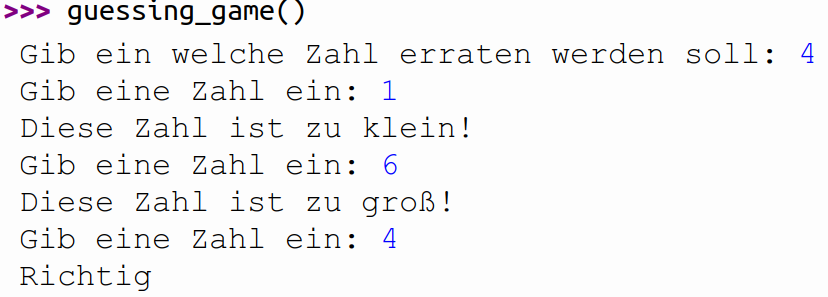

```{.kotlin .cb-run first_number=1}
fun powerOfTwo(x: Int): Boolean {
    var i = 1
    while (i < x) {
        i = i * 2
    }
    return i == x
}

fun halvingSum(n: Int): Int {
    var acc = 0
    var summand = n
    while (summand >= 1) {
        acc = acc + summand
        summand = summand / 2
    }
    return acc
}

fun nbYear(p0: Int, percent: Double, aug: Int, p: Int): Int {
    val percentAsFrac = 1 + percent / 100
    var years = 0
    var currentPopulation = p0
    while (currentPopulation < p) {
        currentPopulation = (currentPopulation * percentAsFrac).toInt() + aug
        years = years + 1
    }
    return years
}

fun isSquare(n: Int): Boolean {
    var i = 0
    while (i * i < n) {
        i = i + 1
    }
    return i * i == n
}

fun nextCollatz(n: Int): Int = if (n % 2 == 0) n / 2 else 3 * n + 1

fun hotpo(n: Int): Int {
    var collatzNumber = n
    var counter = 0
    while (collatzNumber != 1) {
        collatzNumber = nextCollatz(collatzNumber)
        counter = counter + 1
    }
    return counter
}

fun collatz(n: Int): String {
    var collatzNumber = n
    var acc = n.toString()
    while (collatzNumber != 1)
        collatzNumber = nextCollatz(collatzNumber)
    acc = acc + "->" + collatzNumber.toString()
    return acc
}
```

# While-Schleifen

<!-- ## Aufgabe
Implementiere eine Funktion `guessingGame()`{.kotlin}. Diese Funktion
hat keine Parameter. Beim Aufruf fragt sie nach, welche Zahl erraten
werden soll. Anschließend wird solange geraten bis diese Zahl eingegeben
wurde.

{width="70%"}\


## Aufgabe
Erweitere die Funktion `guessingGame()`{.kotlin}, um einen Zähler für
die Anzahl der benötigten Versuche. Beim Ende des Spiels soll ausgegeben
werden, wie viele Versuche der Spieler benötigt hat. -->


## Aufgabe
Implementiere eine Funktion `powerOfTwo`{.kotlin}, die prüft, ob eine
nicht negative ganze Zahl eine Zweierpotenz ist.

``` {.kotlin .cb-nb first_number=1}
powerOfTwo(0)
```
``` {.kotlin .cb-nb first_number=1}
powerOfTwo(1)
```
``` {.kotlin .cb-nb first_number=1}
powerOfTwo(2)
```
``` {.kotlin .cb-nb first_number=1}
powerOfTwo(5)
```
``` {.kotlin .cb-nb first_number=1}
powerOfTwo(16)
```

<!-- <https://www.codewars.com/kata/534d0a229345375d520006a0/train/kotlin> -->


## Aufgabe
Implementiere eine Funktion `halvingSum`{.kotlin}, die für eine positive
Zahl $n$ die Summe $$\mathtt{n + n/2 + n/4 + \dots + 1 }$$ berechnet.
Z.B. gilt $\mathtt{halving\_sum(25) = 25 + 12 + 6 + 3 + 1 = 47}$.

``` {.kotlin .cb-nb first_number=1}
halvingSum(25)
```
``` {.kotlin .cb-nb first_number=1}
halvingSum(1)
```

<!-- <https://www.codewars.com/kata/5a58d46cfd56cb4e8600009d/train/kotlin> -->


## Aufgabe
Implementiere eine Funktion `nbYear`{.kotlin}, die berechnet wann eine
Population mit gegebenem Anfangsbestand, jährlichem prozentualen
Wachstum und jährlicher Zuwanderung eine bestimmte Grenze überschreitet.

Z.B. könnte man eine Kleinstadt mit $1000$ Einwohnern, einem jährlichen
Wachstum von $2$ Prozent und $50$ Personen, die jedes Jahr in die Stadt
ziehen betrachten und sich fragen wann $1200$ Personen in der Stadt
wohnen.

$$\begin{aligned}
\textnormal{1. Jahr } & 1000 +  \lfloor{1000 * 0.02} \rfloor  + 50 = 1070 \textnormal{ Einwohner } \\
\textnormal{2. Jahr } & 1070 + \lfloor{1070 * 0.02} \rfloor + 50 = 1141 \textnormal{ Einwohner } \\
\textnormal{3. Jahr } & 1141 + \lfloor{1141 * 0.02} \rfloor + 50 = 1213  \textnormal{ Einwohner }
\end{aligned}$$ Die Grenze ist also nach $3$ Jahren erreicht.\


Die Klammern um den mittleren Term stehen für eine Abrundung. Es können ja keine halben Personen dazukommen.

``` {.kotlin .cb-nb first_number=1}
nbYear(1000, 2.0 , 50 , 1200)
```

<https://www.codewars.com/kata/563b662a59afc2b5120000c6/train/kotlin>


## Aufgabe
Implementiere eine Funktion `isSquare`{.kotlin}, die prüft, ob eine
natürliche Zahl eine Quadratzahl ist.

``` {.kotlin .cb-nb first_number=1}
isSquare(0)
```
``` {.kotlin .cb-nb first_number=1}
isSquare(1)
```
``` {.kotlin .cb-nb first_number=1}
isSquare(2)
```

<!-- <https://www.codewars.com/kata/54c27a33fb7da0db0100040e/train/kotlin> -->


## Aufgabe
Collatz-Folgen werden nach dem folgenden Prinzip gebildet.

1.  Wähle eine beliebige natürliche Zahl $n$

2.  -   Wenn $n$ gerade ist, wähle als nächstes Folgenglied
        $\frac{n}{2}$

    -   Wenn $n$ ungerade ist, wähle als nächstes Folgenglied $3*n + 1$

3.  Wiederhole Schritt 2 immer wieder bis die Zahl $1$ erreicht ist.

Formaler ausgedrückt, wird die folgende Funktion auf ein Folgenglied
angewendet um das nächste Folgenglied zu erhalten.

$$f(n) = \begin{cases} n/2 &\textnormal{falls n gerade ist } \\ 3n+1 & \textnormal{falls n ungerade ist } \end{cases}$$

Z.B. erhält man für die Startzahl $5$ die folgende Collatz-Folge:
$5, 16, 8, 4, 2, 1$

Implementiere eine Funktion `hotpo`{.kotlin}, die berechnet wie viele
der oben erklärten Berechnungen durchgeführt werden müssen, um von einer
eingegeben Startzahl auf die Zahl $1$ zu kommen

``` {.kotlin .cb-nb first_number=1}
hotpo(1)
```
``` {.kotlin .cb-nb first_number=1}
hotpo(5)
```

<!-- <https://www.codewars.com/kata/577a6e90d48e51c55e000217/train/kotlin> -->


## Aufgabe
Implementiere eine Funktion `collatz`{.kotlin}. Diese gibt einen String
zurück, der alle Zwischenergebnisse der Collatz-Folge anzeigt, bis $1$
erreicht wurde.

``` {.kotlin .cb-nb first_number=1}
collatz(1)
```
``` {.kotlin .cb-nb first_number=1}
collatz(5)
```

<!-- <https://www.codewars.com/kata/5286b2e162056fd0cb000c20/kotlin> -->

